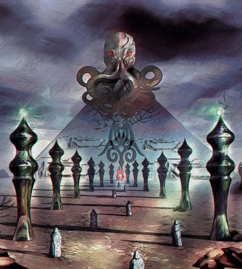
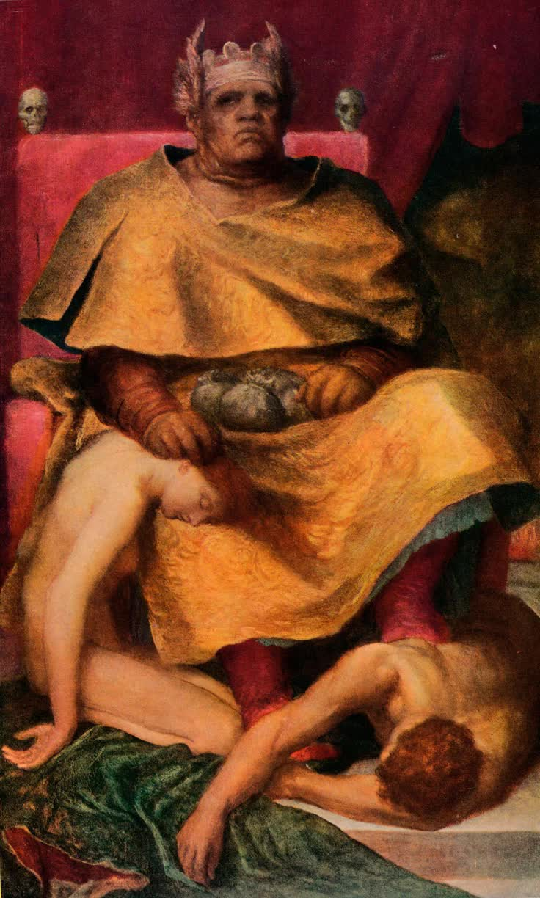
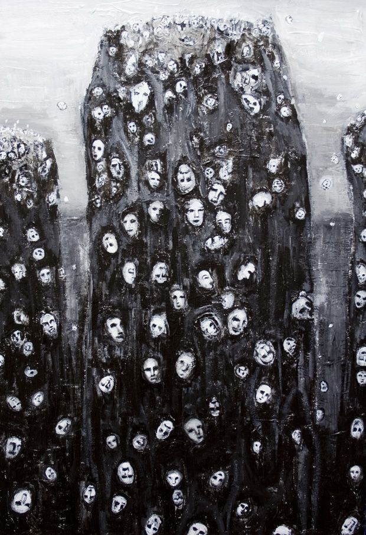
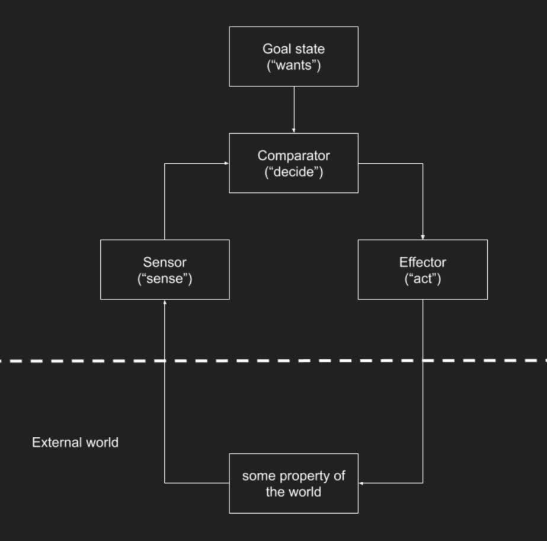
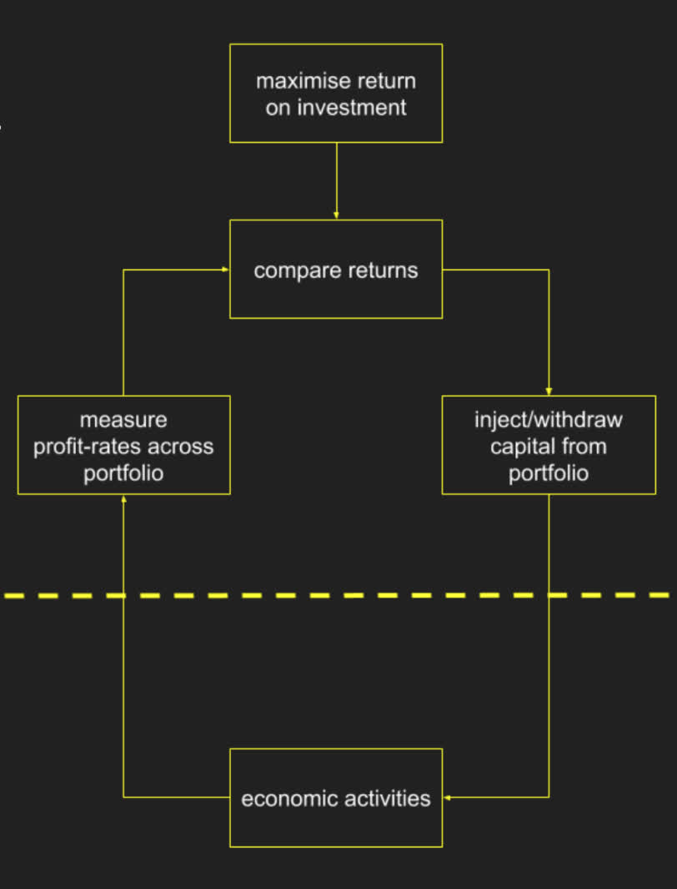
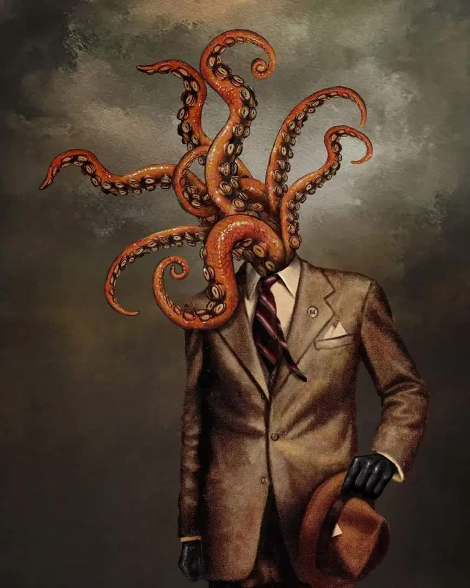
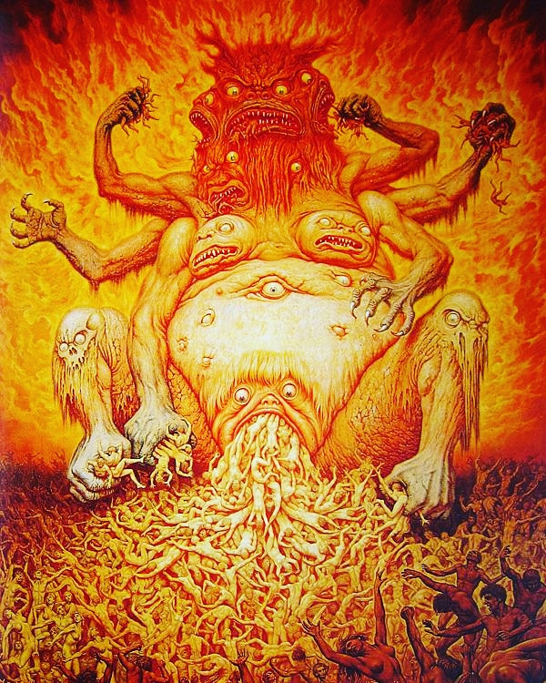
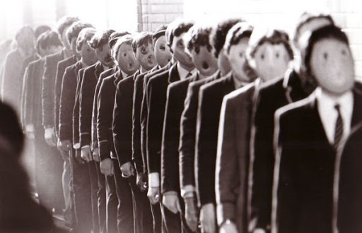
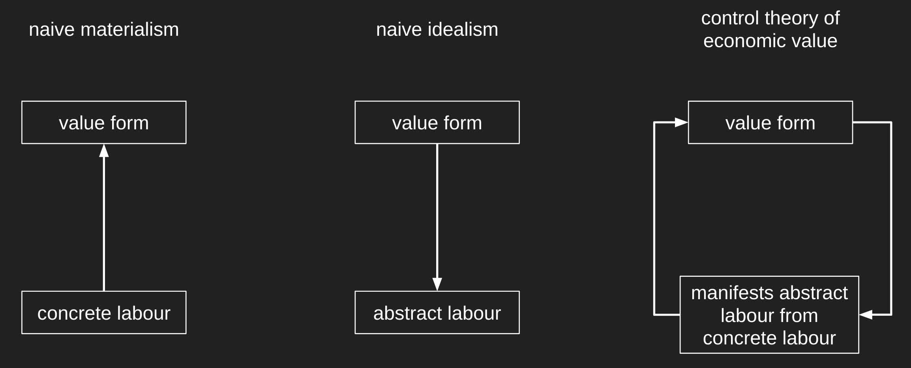

###### Adapted from [https://ianwrightsite.wordpress.com/2021/11/26/essays-on-capital-as-a-real-god/](https://ianwrightsite.wordpress.com/2021/11/26/essays-on-capital-as-a-real-god/) (with permission of the author)

###### Cover adapted from Harmonic Tower by [Daniel Martin Diaz](https://www.danielmartindiaz.com/)

## I. Marx on Capital as a Real God

### Introduction

There is a specific aspect of Marx’s theory of capitalism that I believe isn’t sufficiently emphasised. And that is Marx’s view that capital is an actual entity — a being with a mind of its own that operates independently from us.

And of course, when stated plainly like this, the proposition seems absurd. How can a large sum of money that is used to make profit have a mind of its own? That doesn’t make any sense at all.

But my aim, here, is to explain precisely why this proposition is not absurd, but in fact articulates the essential nature of capital, and that viewing capital as an entity is necessary to fully understand the social reality that we find ourselves in.

### Marx’s Alien Entity

Marx viewed capitalism as a semi-conscious social formation in the thrall of objective economic laws that no-one really controls. And Marx repeatedly points out that capitalism reproduces the religious mystification we find in earlier stages of history, but in new forms — such as commodity fetishism. So it’s quite typical for Marx to employ religious metaphors when discussing capitalism.

But Marx, in comments on James Mill written in 1844, says something more. After making his typical point that the essence of money is a specific kind of social practice — rather than some property of a material thing, such as gold — he then says that our social practice has become an independent, material thing — an actual entity, a “real God” — that has real causal powers. And that we are slaves to this god, and its cult has become an end in itself.

> The essence of money is … the mediating activity or movement, the human, social act by which man’s products mutually complement one another, is *estranged* from man and becomes the attribute of money, a *material thing* outside man. Since man alienates this mediating activity itself, he is active here only as a man who has lost himself and is dehumanised; the relation itself between things, man’s operation with them, becomes the operation of an entity outside man and above man. Owing to this *alien mediator* – instead of man himself being the mediator for man – man regards his will, his activity and his relation to other men as a power independent of him and them. His slavery, therefore, reaches its peak. It is clear that this *mediator* now becomes a *real God*, for the mediator is the *real power* over what it mediates to me. Its cult becomes an end in itself. [^1]

And we should make special note that Marx says a “real” god, and not an imaginary god. So Marx is not talking about the mere ideological worship of the idol of free enterprise or the market, but actual material subordination to an actually existing entity.

### Science or Metaphor?

This is not merely commodity fetishism, but a full blown Lovecraftian nightmare.

Surely this is hyperbole? Marx’s talk of commodity production manifesting, or invoking, an “entity” that is a “real god” with “real powers” must be a poetic metaphor, which aims for dramatic impact rather than scientific precision?

We are strongly predisposed to interpret Marx metaphorically, rather than literally, because our modern, commercial culture is thoroughly secular, and we live it every day. Economics, as we all believe, is fundamentally a profane, not a sacred, endeavour. Commercial activity aims for worldly success, not spiritual enlightenment. And success depends ultimately on some mastery of the social and material world, which requires industry, experimentation, and reason — and not worship of, subordination to, and faith in higher beings. Capitalism embraces scientific rationality and technological progress, and has happily detached itself from earlier beliefs about all-powerful gods.

Plus, many of us, I hope, are hard-nosed scientists. And so we should be immediately sceptical of claims about mysterious entities that exist “outside man and above man”.

So this is the question I want to address is the following: is Marx’s “real God” really real? Is it an entity that actually exists? Or is it mere metaphor, which serves to illustrate, or dramatise, some properties of social reality? To what extent should we take Marx seriously.

Are we really blindly worshipping an alien god that controls us?

To answer this question I need to revisit some core aspects of Marx’s thought, specifically his theory of economic value, but from a new perspective, that of control theory. And by control theory I mean the scientific and mathematical theory of control systems. This new perspective will help us decide how to interpret Marx’s talk of a “real God”.

### The Affinity Of All Things

We all know that parts of reality can represent or measure other parts of reality. A ruler measures length, a thermometer measures temperature, and so on. We created these measuring devices for a definite purpose.

But the meaning of money, what it might signify or represent, is less clear. Although money first appeared over 2000 years ago, what it may represent as a symbol remains a subject of deep controversy.

To be clear, by “money” I don’t mean actual coins or notes but instead the numerical quantities we see stamped on coins or printed on notes, or stored as bits in computers, and so on. To be really precise, I should say “unit of account”. But saying “money” is simpler, as long as we’re clear about what we mean.

Now, Marx tackles the meaning of money in his famously difficult, opening chapters of the first volume of Capital. He notes that the exchange of commodities in the market implies there’s something equal, or equivalent, about them. For example, if I sell 20 yards of linen for 10 pounds, and then spend my 10 pounds on a new coat, then, indirectly, 20 yards of linen have been made equal to 1 coat by the act of exchange.

If market prices were entirely random there would be nothing more to say because this equivalence would be accidental. But although prices fluctuate they are not random. There is a strong signal in the noise. Typically, you can’t sell a pen and then buy a plane. And you can’t work for a day and then spend your day’s wages to buy a mansion. There are exceptions. But the exceptions prove the rule.

So during any period of time there are definite well-established market prices that determine the ratios in which commodities can exchange, that is are equalised, with each other. And all these exchanges are facilitated by, to use Marx’s phrase, an “alien mediator” that we call money.

### The “Magic and Necromancy” of Commodities

A quick dip into any anthropological textbook quickly reveals that humans entertain the most diverse and extraordinary beliefs about how the world works and how we should conduct our everyday lives. What some cultures consider normal, others would consider strange and bizarre.

We rarely take an anthropological viewpoint on our own culture. That’s because it’s hard to do. It requires stepping out of one’s conceptual framework, and looking at the ordinary and accepted as unusual and questionable.

So let’s take a moment to note how fantastical commodity exchange actually is.

Only dedicated occultists would dare claim that everything we see around us, all the things and activities in the world, are — despite all appearances — really the same. That 1 kg of caviar is “the same as” 1000 different people clicking on the same internet advert. Or clowning at a children’s party is actually “the same as” 200 rounds of shotgun ammunition. Or that 1 month of computing time on a high-spec machine in the cloud is “the same as” 1 tonne of potatoes. Only highly trained adepts could begin to see the truth of such counter-intuitive and magical affinities.

But we more than see the truth of it. We openly and regularly achieve it. We manifest these magical affinities on a daily basis. We treat quantities of fish eggs, human attention, clowning performances, bullets, computing time, potatoes, and a bewildering array of other things, as “the same” — because, in the marketplace, they all may be exchanged for one another, via the “alien mediator” we call money.

Magical traditions rather meekly propose correspondences between planets, minerals and human fate. But the magical operations of our modern commercial world — where every thing, activity and even future event is successfully reduced to comparable quantities of this substance we call “money” — overwhelmingly surpass, in both scale and ambition, the most deranged fantasies of the medieval grimoires. Market exchange achieves a universal affinity between all things under the sun.

It is for these sorts of reasons that Marx writes of the “mystery of commodities” with its “magic and necromancy”.

### The Economic Mysteries

Market societies achieve a titanic conceptual abstraction: every single thing that we swap between ourselves is stamped with a single quantitative property that we call exchange-value. But, rather mysteriously, no single person, no single consciousness, is responsible for maintaining the abstraction.

Marx wrote, “A commodity appears at first sight an extremely obvious, trivial thing. But its analysis brings out that it is a very strange thing, abounding in metaphysical subtleties and theological niceties” (Marx, Capital vol. 1).

So we have two economic mysteries: a ubiquitous social abstraction without any obvious content, and an abstraction without an abstractor.

To decide whether Marx’s “real God” is real or a metaphor, we need to dig deeper into the “alien mediator” that is money, what exchange-value represents, and what, if anything, maintains the abstraction.

### The Content of Value, or Abstract Labour

So let’s begin with the first mystery: what is the abstraction of exchange-value? What do those money quantities actually denote?

Marx argues that exchange-value refers to a special, common property shared by all commodities — that of being the products of labour. So caviar and clicks are the same because, to manifest them as commodities in the marketplace, requires the sacrifice of someone’s labour.

I think that Marx’s argument — for the proposition that the special common property shared by all commodities is labour — is unsatisfactory. I think Marx’s conclusion is correct, but his argument for it isn’t. But I don’t want to take a detour into this debate. So let’s simply accept this at face value for now.

Marx then says that the common property cannot be specific kinds of labour — because fishing for caviar, or writing advertising software, or clowning, or making bullets — are very different activities.

The act of exchange abstracts from the individual peculiarities of different labouring activities, leaving something common to all of them, which Marx calls “human labour in the abstract”, or abstract labour. Commodities, according to Marx, have economic value “only because human labour in the abstract has been embodied or materialised in it”.

Now, we have to be careful with the term “embodied”. Marx doesn’t literally mean that abstract labour inheres within the material body of the commodity. Abstract labour is not a physical property of a thing. What he means is that some definite fraction of the total labour time of society must be used-up, or expended, to produce the commodity and bring it to market.

So abstract labour is not concrete labour, not a specific type of labouring activity, but something else, something deeper and more general. As Marx states, abstract labour has “the character of the average labour-power of society”. So a good first approximation is to think of abstract labour as denoting the causal powers of the typical or average worker. That isn’t quite right, but it will do for now.

So, according to Marx, the titanic abstraction achieved by commodity exchange refers to a specific content, which is a property of the material world that he calls abstract labour.

### How Do We Measure Abstract Labour?

Marx then immediately asks the obvious question, “How, then, is the magnitude of this value to be measured?” and he answers, in a seemingly straightforward way, that it is measured “by its duration, and labour time in its turn finds its standard in weeks, days, and hours.” So we’re talking about units of time.

We might suppose, therefore, that we can immediately pull out our stopwatches and start measuring the amount of time people spend working, and then correlate our measurements with the prices we observe in the market. Because if prices really do represent labour-time then we should, in-principle, be able to scientifically verify this claim.

But that would be too hasty. Before we can even consider empirically verifying Marx’s theory of value, we need more clarity on what that theory actually is.

Now I’m not sure how deliberate this is, especially as I read Marx in translation. But it might be noteworthy that Marx does not ask, “How should we measure quantities of abstract labour?”, and neither does he answer by saying that “we can measure it by its duration”.

And that’s because we don’t measure abstract labour. Something else measures it.

This property of Marx’s theory — that money refers to labour time in virtue of our collective, social activity and independently of our thoughts about it — is radically different from the classical political economy of his day, and also modern economic theory.

The abstraction is not ours because our cognition is not performing the abstraction. We are not the abstractor. Instead, the mysterious abstractor is taking the measurements about labour time and connecting the form of value, which is money, to its content, which is abstract labour.

So, as scientists, our first job isn’t to start measuring labour time. Our first job is to understand what the abstractor is, and how it connects its abstraction to its world. We need a theory of this abstracting entity, and its powers, before embarking on empirical verification.

### Who or What is the Abstractor?

So we have a partial answer to the first economic mystery. The abstraction of exchange-value, or more plainly money, represents “abstract labour”. So let’s turn to the second mystery: who is doing the abstracting? Who or what is the mysterious abstractor?

In fact, Marx has already told us who it is. Sometimes mysteries hide in plain sight. The big clue is Marx’s choice of the title for his magnum opus. The abstractor is what Marx calls “capital”.

But the term “capital” can mislead. First of all, it gets us thinking about large sums of money. A capital sum. But capital is much more than that. And, second, modern economic theory has reduced the term “capital” to a vanilla accounting term that mixes-up, in a confused way, capital equipment with large sums of money.

But capital, for Marx, is first and foremost a social practice. Capital denotes a collection of activities that certain people regularly do embedded within a system of property rights, contracts, and coercive power. Capital is a circuit, where an initial capital sum is “invested” in production, and then typically returns with a profit increment. Capital enlarges itself, whenever it can. This circuit is mediated not only by money, but also economic production itself, including the disciplining and exploitation of workers.

Marx’s standard language — of capital, of social relations of production, circuits of accumulation, and so on — doesn’t fully evoke what’s really going on, and I think that’s why he often turned to religious language.

So instead of saying “capital” I’m also going to say “the controller”. Because capital is a control system, not merely in the political sense, but in the more profound and scientifically important sense of being a negative feedback control system. Capital is literally a controller. So if capital is a controller, then how does it work, and what does it control?

### Control Systems

Scientific progress sometimes consists in organising a whole range of diverse phenomena under a single principle. The emergence of cybernetics, in the early 20th Century, was just such an event.

The core idea of cybernetics is that many different kinds of systems — be they mechanical, physical, biological, cognitive, or social — are types of control systems that exhibit a particular kind of causal structure, the negative feedback control loop.

And it turns out that negative feedback control explains how parts of reality can control, and therefore refer to, other parts of reality.

Take the mundane example of a thermostat. You set the system’s goal by fiddling with its temperature setting. The thermometer-component of the system measures the room’s temperature. The thermostat mechanically compares its setting to the measured temperature. If the temperature is too high, then the thermostat emits a signal to turn the heating on; otherwise it turns the heating off. In this way, the heating system controls the temperature of the room. And it will do this autonomously, without you ever having to touch it again.

All negative feedback control loops have four main components: (i) an internal goal-state, (ii) a sensor that measures some property of the external world, (iii) a comparator that compares the sensor reading to the goal state, and (iv) an effector or action system, which changes the world to move closer to the goal state.

The temperature of our bodies is controlled by a similar kind of biological feedback loop, except the control loop isn’t implemented upon metal, wires and plastic, but upon nerves, enzymes, and sweat glands.

In fact, all homeostatic and goal-directed systems in nature conform to this causal template. Different examples just implement the components of the control loop in different ways.

And, perhaps surprisingly, there is a very significant control loop, hiding in plain sight, which affects every aspect of modern life in the most profound and intimate manner.

### Capital as a Negative Feedback Control System

The basic unit of production, where capital meets labour to produce goods and services, is the capitalist firm. And every profit-maximising firm is owned by a private capital.

Capitalists extract profits from firms. They can spend only a fraction of their profits on luxury consumption. Because if the rich spent all their profit on luxuries their capital will rapidly diminish and expire, compared to competing capitals who invest their profit in further profitable activities. Profit income must be reinvested in order to make more profit. This is the prime directive for anyone who possesses a capital sum of money.

Owners of capital — that is capitalists — can’t put all their eggs in one basket. That’s too risky because firms can go under, or assets that store value might depreciate. So capitalists spread their risk by owning a portfolio of investments with different risk profiles.

A typical portfolio will consist of cash held in different sovereign currencies, government, municipal and corporate bonds, shares in different companies, from risky start-ups to blue chips, and all kinds of income-producing assets, such as land and housing. Basically anything that might yield a higher than average return.

Each individual capital must aim to maximise the return over its portfolio. If it fails it will diminish in size relative to other capitals, and eventually cease being a capital at all.

And it’s right here that we again find the causal structure of a feedback control system. An individual capital — when we consider it as a social practice mediated by a privately owned large sum of money — also has its own goal state, sensory inputs, decision making, and ability to act upon the world in which it is embedded.

Let’s take each of these in turn. (i) The goal of an individual capital is to maximise the average return from every dollar (or pound) invested. (ii) The “sensory inputs” are the different profit-rates earned across the portfolio. (iii) The capitalist, or the financial experts they employ, compare the different profit-rates, and (iv) the feedback loop is closed by actions that withdraw capital from poorly performing investments, and inject capital into high performing investments.

This control loop manifests as an insatiable and ceaseless search for high returns.

Capital doesn’t care how its money is actually used in production. It entirely abstracts from all concrete activities. The only thing it can sense, compare and use is abstract value.

So the commanding heights of the global economy consists of an enormous ensemble of individual capitals, each manically scrambling for profit, reacting to the signals of differential returns received from its tendrils that extend to every productive activity under its rule, continually injecting and withdrawing capital to and from different industrial sectors and geographical regions. The entirety of the world’s material resources, including the working time of billions of people, are repeatedly marshalled and re-marshalled away from low and towards high-profit activities. In the space of months, entire industrial sectors may be raised up, relocated, or thrown down.

### Capitalists are Possessed, Mere Machine Components of Capital

What about the individual people who participate in this social practice? Surely their individual consciousness, their ideas, and their behaviour matter, and make a difference?

To a certain extent they do of course. But individuals come and go, but capitals live much longer than any individual human. The people controlled by the capital — that is the workers that supply labour to firms, and capitalists that exploit them and extract profits — are mere replaceable components in the control loop, mechanically performing prescribed functional roles.

For example, Marx writes in Capital, that:

> “to classical economy, the proletarian is but a machine for the production of surplus-value; on the other hand, the capitalist is in its eyes only a machine for the conversion of this surplus-value into additional capital.” [^2]

We often say that a capitalist possesses capital. But it is more accurate to say that capital possesses them. Capitalists are the human face of an inhuman intelligence with its own logic and its own goals.

> “In bourgeois society capital is independent and has individuality, while the living person is dependent and has no individuality” (Communist Manifesto). [^3]

### The Demonic Power of Capital

Bigger capitals enjoy the advantage of larger portfolios, which spreads risk. In consequence, capital tends to concentrate in a few hands. So we find a large number of small capitals, and a very small number of astronomically large capitals, which earn profits that dwarf the GDP of many nation states. The scale and power of some capitals is truly titanic.

And these titans are so much in control, that they are out of control. Again, a quote from the Communist Manifesto:

> “Modern bourgeois society, with its relations of production, of exchange and of property, a society that has conjured up such gigantic means of production and of exchange, is like the sorcerer who is no longer able to control the powers of the nether world whom he has called up by his spells.” [^4]

In mythology, demons are anarchic, out-of-control entities that cause us harm, through tormenting us or through possession. Not only is the power of capital titanic, it is demonic. Let’s just briefly consider a few examples.

Every day millions of workers, around the globe, have no choice but to sacrifice their time, and their vitality, to produce new profit for the autonomous controllers. No matter how hard, long or efficiently we work, the imperative to work remains.

Why? Because every labour-saving technical innovation takes the form of profit, which is then captured by individual capitals, and immediately re-injected into the material world to animate new activities for further profit. This is why, despite huge advances in automation, the working day remains as long as ever.

Take another example: the logic of capital demands maximum profit extraction from firms, and that means minimising wages. Those possessed by capital live an exalted existence. But the world’s dispossessed must feed, clothe and maintain a home with an average income of about 7 pounds a day.

Another example: it’s better to be exploited than not exploited. We are subject to the whims of the business cycle and periodic crises of accumulation. Recessions regularly throw large numbers of people out of work, through no fault of their own. Suddenly bills can’t be paid. Families are thrown onto the street, as happened in the US during the 2008 mortgage crisis, and is happening again now.

Why? Because individual capitals are almost blind. They see only differential returns across their portfolios. And returns may be good even if unemployment is high, or human misery spills onto the streets. Capital does not care.

Another example: capital deals in abstract value, and things that are not owned, which aren’t bought and sold, therefore have no value to it at all. So the material wealth of nature — the land, the oceans, and the atmosphere — is relentlessly plundered without any regard for the consequences.

Capital destroys us, and the environment. The endless production and profit-making cannot stop, because each individual capital must compete to survive. Marx summarised the prime directive of capital as:

> “Accumulate, accumulate! … reconvert the greatest possible portion of surplus-value … into capital! Accumulation for accumulation’s sake, production for production’s sake: by this formula classical economy expressed the historical mission of the bourgeoisie”. [^5]

So all the autonomous control loops have the single-minded goal of extracting profit from the world’s activities. If an activity fails to satisfy this goal, then the controller withdraws its capital, and the activity stops.

So at the apex of the economy we have a competing collection of identical controllers — with an atavistic, low level of demonic intelligence — which inject and withdraw a social substance that appears to possess the magical power of animation, of bringing things alive, of creation; but also appears to possess the power of annihilation, of suffocation, of bringing things to an end, of destruction.

We are definitely not in control. And something else definitely is in control.

### Animism

So what are we really talking about now?

We’re saying that a new kind of supra-individual control system emerged, quite spontaneously, from our own social intercourse, and then — in a very real sense — has taken on a life of its own, turned around, and started controlling us.

Capital in a scientific, not a metaphorical sense, is a control system. And it is capital, as a control system, that ultimately creates and maintains the abstraction we call exchange-value. Capital is the abstractor.

But before we can fully explain how that happens we need to take some moments to explore the relationship between control systems and primitive forms of cognition.

So, the earliest humans were at the mercy of nature. At any time, the harvest might be ruined, or illness or injury might strike. The earliest theoretical framework to explain the capricious forces of nature seems to be animism.

Animism is the belief that all natural phenomena — such as the weather, geography, plants, trees, animals and so on — are ultimately controlled by an autonomous, living entity with human-like agency. Early humans believed that different clusters of empirical phenomena were controlled by conscious spirits, with minds of their own.

Marx gives us a very brief sketch of this history of religion in Part 3 of “Anti-Duhring”, which begins with a discussion of animism. The weather gods, sea gods, sun gods, moon gods, gods of illness and healing, and so on, are the hidden actors, or ultimate cause, of uncontrollable events.

Now, if you believe gods are invisible hands that affect your life, then it makes perfect sense to appeal to them — by praying, or giving them gifts, or building temples to worship them. The power and majesty of the ancient gods was the perverted expression of the powerlessness and misery of early humans.

### The “Real God”: Beyond Commodity Fetishism

Today, we enjoy a great deal more control over our lives compared to our ancestors. And this material progress, in itself, has gradually removed the material basis for animistic belief systems.

Many of the causal powers of the ancient gods and demons, have, one by one, been explained by science. And so they lost their power. Instead of a ragbag of pagan gods, with special powers and domains, we have scientific fields with their own theories and technical terminology.

Of course, animistic religion persists in capitalist society, but typically well outside the mainstream. As Marx explains, in his short sketch:

> “At a still further stage of evolution, all the natural and social attributes of the numerous gods are transferred to one almighty god, who is but a reflection of the abstract man.” [^6]

So modern mainstream religions, such as Islam and Christianity, talk of one, all-encompassing god, who is remote and abstract, and unlike the animistic deities of old, typically doesn’t interfere in everyday phenomena.

Marx then turns to modern society, and makes the important point that capitalism does not abolish the material conditions that give rise to religious beliefs:

> “in existing bourgeois society men are dominated by the economic conditions created by themselves … as if by an alien force. The actual basis of the religious reflective activity therefore continues to exist … It is still true that man proposes and God (that is, the alien domination of the capitalist mode of production) disposes.” [^7]

Precisely because capital is in control, and not people, then the “actual basis” of “religious reflection” continues to exist.

Famously, in the first chapter of Capital, Marx explains how market exchange necessarily generates commodity fetishism — which is the illusion that economic value is a natural or material property of commodities. So inanimate objects — especially forms of money, such as gold — fetishistically appear to have special powers in-and-of themselves.

But Marx’s talk of a “God” that we “propose” to and it “disposes” takes us beyond commodity fetishism. Marx is pointing to the fact that economic laws have god-like powers that operate independently of us, and control and dominate us, like forces of nature.

Is Marx therefore committing an animistic fallacy by suggesting that capital, as an independent entity, is a “real God” with “real powers” that as a mind of its own?

Once we understand capital to be an autonomous control system, then the answer is a plain “no”. A negative feedback control loop has all the basic elements of cognition: it in fact senses, decides and acts. A qualified kind of animism is entirely appropriate here.

Of course, the sensing, thinking and acting cycle of an individual capital is quite unlike that of an individual human being. Nonetheless, both pursue distinct goals, and both have the power to make things happen. One control system consists of neurons, muscles and organs; while the other consists of social practices, belief systems and the exchange of a value substance.

So, speaking animistically, a spirit, or deity, indeed controls capitalism. This god can shatter itself, and appear at multiple times in multiple places. And it can combine with versions of itself, to aggregate into bigger and more powerful incarnations. It can possess humans, and control them, by forcing them to work, or forcing them to accumulate. This entity directs social activity by giving and withdrawing its magical substance, which we call value. We sacrifice ourselves to it, we appease it, and we hope it will favour us.

All these statements are scientifically accurate. They are not metaphors. In fact, adopting a more animistic theory of modern capitalism would, counter-intuitively, constitute scientific progress.

Let’s now take this animistic point of view and enquire what capital, as a god-like entity, tends to think about. What are the contents of capital’s cognition?

### What Does the Real God Control?

Sometimes it’s obvious what a particular control system controls, because we designed it. For example, we know that a thermostat controls room temperature. In consequence, the electrical control signals that flow within the thermostat refer to temperature.

But the vast majority of control systems are not designed by people. Nature is stuffed full of them, from simple homeostatic mechanisms to incredibly complex animal brains. These systems evolved, without a designer, and therefore we have to work harder to determine what they control, and what their internal representations may, or may not, represent in their environment.

I will skip the details of a scientific theory that determines what controllers in fact control. It’s not a simple story [^8]. I think the complexity of that story partially explains why Marx’s argument that abstract labour is the substance of value, in the opening chapters of Capital — chapters that he famously worked and re-worked, that Engels joked bore the marks of Marx’s painful carbuncles — is not entirely satisfactory. Marx had stumbled upon a hard problem that couldn’t be fully solved with the conceptual tools of his time.

So, instead of going down this rabbit hole, I’ll instead jump to the conclusion and simply state what capital, as a control system, in fact controls.

We already know that capitals, both big and small, are intimately connected to the process of production. The capitalist firm borrows capital to buy inputs and means of production, and hire workers. Workers supply concrete labour to produce use-values for sale in the market.

Now, the controller judges all the different concrete activities occurring across its portfolio in the same way: which activities yield above-average returns, and which do not? The controller rewards firms that make comparatively high profits with new injections of investment; but punishes firms that make comparatively low profits, or losses, by withdrawing its capital. These monetary rewards and punishments flow down, through firms, into the labour market, and reward concrete labour by the payment of wages, or punish by withdrawal and unemployment.

In this very real sense, capital wants specific kinds of concrete activities, and does not want other kinds. The kinds of activities it wants are those that yield above-average profit. Capital is therefore controlling us. And it controls how we spend our time.

### Abstract Labour: The Kind of Labour That Capital Wants

So capital wants labouring activities that yield profit. Simplifying, we can identify two essential properties that concrete labour must possess in order to yield profit.

First, it must be useful to others, that is produce commodities that can be sold in the market. No-one will buy a coat with three arms.

Second, it must have above-average efficiency; in other words, a firm makes more profit if it uses-up less labour-time than competitors that produce the same commodity.

And this is why, just after Marx first introduces the concept of abstract labour, he immediately points out that only socially necessary, and useful, labour counts as abstract labour.

Capital does not want workers to spend time smelling the roses with their family and friends. That activity doesn’t yield saleable use-values. Neither does capital want workers to slack on the job, or become ill. Slacking or illness isn’t efficient. Capital, if it completely had its way with us, would have us spend all our time labouring in the firm at the highest possible intensity, continually striving to out-compete other workers in the labour market. This is the kind of behaviour that capital wants.

So capital controls concrete labour, the real labouring activities of the working population in all their diverse manifestations. And capital controls actual labour-time, actual clock times of real people doing real things. It is capital itself that holds a metaphorical stopwatch in its hand, measuring and accounting, and judging and condemning; always on the look-out for the slightest slacking off or insubordination.

And the goal of capital is to convert concrete labour into abstract labour, into the kind of labour that both fits into the division of labour, so it can be exchanged against other labour, and into the kind of labour that fully sacrifices itself to capital, gives itself up as tribute, in order to yield profits for the capitalist firm, and ultimately the controlling, dominant capitals that stand behind them.

In other words, “abstract labour” is manifested, brought into reality, by capital itself. *Maximising profit is identically the process of maximising the manifestation of abstract labour out of concrete labour*.

This is why Marx says that only abstract labour “creates value”. Concrete labour may or may not create value. If it doesn’t, it isn’t abstract labour, and capital as a controller quickly works to eradicate its existence, by withdrawing capital from the firms that employ it.

### Capital as Egregore

So capital is a controller that employs a form of value — money — to control the content of value — which is our labour time. The form and the content are bound together, linked semantically in a relation of representation to referent, by the lawful regularities instantiated by generalised commodity production.

As we have seen, control systems instantiate the basic elements of cognition. They in fact have internal representations that refer to the world they act in. In consequence, *Marx’s theory of value is fundamentally a theory of an alien cognition that controls us*.

No wonder he wrote of the necromancy of commodity production because only the religious, magical and occult traditions in our history have adequate concepts to express our predicament.

The occult concept of an egregore is useful here. An egregore is a non-physical entity that exists in virtue of the collective ritual activities of a group yet operates autonomously, according to its own internal logic, to materially influence and control the group’s activities. The group creates the egregore, and the egregore creates the group, in a self-reinforcing feedback loop.

Marx, in his Economic and Philosophical Manuscripts of 1844, explicitly calls out this reciprocal relationship between a god and its people, between a cult and its egregore.

> “as a result of the *movement of private property* … we have obtained the concept of *alienated labor* … But … it becomes clear that though private property appears to be the reason, the cause of alienated labor, it is rather its consequence, just as the gods are *originally* not the cause but the effect of man’s intellectual confusion. Later this relationship becomes reciprocal.” 

The ritual activities of the initial capitalist cults were materially so successful they rapidly metastasised and, in a few centuries, engulfed the world. What is universal becomes the unnoticed background. So the egregore, in our society, is hard to see. It hides in plain sight. We refer to it, of course, but obliquely, using soporific names, such as “the economy” or “the markets” or “capital”. But Marx pointed to a better name for it, one designed to wake us from our slumber: *A real God with real powers*.

### An Alien Cognition that Binds Value Form to Labour Content

So capital is an egregore. Not metaphorically, or ironically, but actually. Capital is a being, an autonomous entity, with primitive thoughts about us. Money is how it measures us, and money is how it commands us. Capital is an alien cognition that acts in the world to bind the form of value to its content.

So now we know what the abstractor is. And now that we have a clearer grasp of the core structure of Marx’s theory of value it becomes much easier to spot misinterpretations of it.

There are misinterpretations that emphasise the content at the expense of the form. Marx’s theory is not at all like the naive materialism we find in classical political economy, or modern Sraffian interpretations of Marx, which posit one-way causation from concrete labour-time to money prices. Instead, we must think about feedback loops, about two-way causation, from content to form, and from form back to content.

But there are other misinterpretations that emphasise the form at the expense of the content.

Clearly, Marx’s theory is an objective theory of value. Despite the pretensions of subjective utility theories of value we cannot collectively wish planes to be cheaper than pens. We are not the dominant controller, we are the controlled. The individual consumer is not king.

But more sophisticated variants of idealism also misinterpret Marx’s theory. Some Marxists think capital dreams about abstract labour, that abstract labour is an invention of the capitalist system, which doesn’t actually refer to something existing independently in objective reality. This reduces Marx’s theory to a postmodernism parody of ghostly and ideal forms.

In these misinterpretations the form has no content. And so money doesn’t refer to any property that exists independently of it. The form creates an illusory content. In this view, abstract labour may indeed have real effects, in the way that belief in an Father Christmas may cause people to offer cookies and milk, but it doesn’t really exist.

This may seem sophisticated but ultimately it reduces to value nihilism, where there are only prices, and there is nothing hidden behind them.

But Marx’s theory is essentially about the control of concrete labour time, the actual objective working conditions of millions of people. Any interpretation of Marx that claims abstract labour cannot be measured independently of markets and prices, or cannot provide a definition of the content of value without relying on magic coefficients that depend on prices — has gone awry.

Of course, like any entity, capital’s thoughts may not perfectly reflect, or represent, the reality in which it is embedded. However, if a control system successfully controls then its internal representations will bear a truthful correspondence to reality. And capital is a supremely successful controller.

And, ultimately, this is why Marx’s value claims can be empirically verified: labour is already disciplined to be efficient and useful. And so the majority of concrete labour is already abstract labour. In consequence, if we pick a group of 50 workers randomly they will approximate the value-producing power of 50 units of abstract labour. Take larger aggregates and the approximation only improves.

Taking out our stopwatch won’t work at the level of an individual worker because there’s no guarantee their concrete labour will ultimately count as abstract labour. But our stopwatch will measure abstract labour if we collect sufficient samples. As Marx stated, abstract labour has the character of the average labour-power in society. So the control success of capitalism means we can measure quantities of abstract labour before that labour is equalised and homogenised in the market.

An analogy might help here, because this is quite a subtle but important point.

An ethologist, studying the behaviour of an animal in the wild, can’t truly get inside the animal’s head and see the world through its eyes. The ethologist can never fully know what it’s like to be a bat. But nonetheless ethologists have developed detailed theories of echolocation, and how a bat’s cognition represents its environment. In a similar way, we are studying the behaviour of an autonomous entity, called capital, with an alien cognition. Abstract labour is its concept, not ours. But we can form a concept of abstract labour that corresponds to its concept of abstract labour. After all, we, the controlled, and it, the controller, all live in the same world. And we can both talk about, and represent, an objective property of that shared world.

And what is that objective property? We can now refine our initial, approximate definition of abstract labour. It is not just average labour, or the common causal powers of human labour. It is something more specific, something more historically determined and therefore contingent.

Abstract labour is a collection of causal powers possessed by human labour that can manifest as an ability to produce an endless variety of useful things for others, to make profits by working harder or longer, to improve techniques of production so more may be produced with less, and to out-compete others in a ceaseless scramble for profit. If we workers lacked these causal powers then capital would fail to mould us into the value-creating, homogeneous units that it wants.

### Capitalism as an Occult Mode of Production

Capital isn’t a huge sum of money but a definite set of social practices that instantiate a control system. Each capital is a controller that acts independently of any individual human consciousness. In this very real sense, each capital is an entity, a being-for-itself. And each capital has primitive forms of cognition: capitals continually sense, decide and act in order to achieve the overriding goal of maximising returns. This is not a metaphor, but science. Marx’s “real God” is really real.

Marx reminds us that capitalism does not abolish the material conditions that give rise to magical and religious thinking. Commodity fetishism is rife, and confusions abound. For instance, modern economic science has successfully repressed Marx’s theory of value, and the theft-based nature of capitalist property relations, yet has proved itself incapable of formulating an alternative theory of economic value. The economic mysteries remain.

To add to the confusion and mystification, capitalist ideology promotes the idea that our commercial culture is fundamentally a rational and secular endeavour. But the opposite is the case. The rationality of capitalism is not human but alien, and we do not control it, but it controls us. Capitalist ideology refuses to see the “real God” that is capital, and our subordination to it. The god is real, but hidden, hiding in plain sight. And in this sense, *capitalism is an occult, not a secular, mode of production*.

The value form, the titanic abstraction that permeates every aspect of our lives is, in a sense, the primitive language of the controller. It sees and judges our activities in terms of abstract value, by comparing differential profit-rates across its portfolio. But it also commands our activities using abstract value, by injecting and withdrawing its substantial being, which is money. Capital works to mould, shape, and discipline the total labour-power of society into the specific form of abstract labour, which is labour that gives itself up, utterly and completely, as tribute to capital.

So the value form participates in both measuring labour time, and also commanding labour time. We shouldn’t be surprised that *the value form also has imperative semantics*. Money doesn’t merely participating in measuring but it also commands. Generalised commodity exchange has no conscious planner or plan, and therefore the command and control necessary to organise the division of labour is achieved through the allocation of capital, the transmission of money and the structure of prices.

Capital commands concrete labour time to manifest as abstract labour time, and therefore brings into being what is already latent within us. But capital intensifies and perfects only a part of us. We are more than merely creatures able to manifest abstract labour. We have the power to do much more than merely produce useful things by working intensely for long hours. So, despite capital’s rule we resist, and find places and moments where we can be more fully ourselves. But capital does not want us to play, learn, explore, care or give freely. Capital wants us to produce — endlessly. And therefore we, under the rule of capital, are reduced to shadows, mere narrow abstractions, of what we could be.

*We are the abstracted, and it is the abstractor*.

### Slaves to the God Capital

Allow me to finish with a very blunt analogy. Cows can do lots of things. But all we care about is that they produce as much milk and meat as possible. And so we breed them, inject them, rear them, and control them to do only that. Sometimes their udders are so distended by excessive production they tear, split and spill.

We are cattle to capital. We too have become distorted and disfigured by its universal rule. It brands us as abstract labour. But we are also concrete individuals. The form does not exhaust the content. And this seemingly innocuous non-identity between form and content is the fundamental reason why, one day, we will escape from capital’s rule.

[^1]: [https://www.marxists.org/archive/marx/works/1844/james-mill/](https://www.marxists.org/archive/marx/works/1844/james-mill/)

[^2]: [https://www.marxists.org/archive/marx/works/1867-c1/ch24.htm](https://www.marxists.org/archive/marx/works/1867-c1/ch24.htm) 

[^3]: [https://www.marxists.org/archive/marx/works/1848/communist-manifesto/ch02.htm](https://www.marxists.org/archive/marx/works/1848/communist-manifesto/ch02.htm)

[^4]: [https://www.marxists.org/archive/marx/works/1848/communist-manifesto/ch01.htm](https://www.marxists.org/archive/marx/works/1848/communist-manifesto/ch01.htm)

[^5]: [https://www.marxists.org/archive/marx/works/1867-c1/ch24.htm](https://www.marxists.org/archive/marx/works/1867-c1/ch24.htm)

[^6]: [https://www.marxists.org/archive/marx/works/1877/anti-duhring/ch27.htm](https://www.marxists.org/archive/marx/works/1877/anti-duhring/ch27.htm)

[^7]: Ibid.

[^8]: [https://papers.ssrn.com/sol3/papers.cfm?abstract_id=2262133](https://papers.ssrn.com/sol3/papers.cfm?abstract_id=2262133)