## II. Dark Eucharist of the Real God

Capitalist society, when it reflects upon itself in the mirror of social theory, sees a vision of a secular and rational mode of production not without blemish but ultimately shaped by the pragmatic yet noble pursuit of material progress. In contrast, earlier historical epochs, when they gazed into the mirror, became enchanted by the glittering reflection of a pantheon of god-kings and super-human deities. In such circumstances the direction of history was partially governed by a great intercourse between peoples and their gods. But we moderns, more mature and more fully conscious, gaze with unencumbered clarity at the true reflection of our own humanity, now alone but free of mystification. We collectively although confusedly make our own history without relations with the beyond. For we, unlike our less enlightened precursors, have rid ourselves of all enchantment.

> “The reform of consciousness consists only in making the world aware of its own consciousness, in awakening it out of its dream about itself, in explaining to it the meaning of its own actions. Our whole object can only be – as is also the case in Feuerbach’s criticism of religion – to give religious and philosophical questions the form corresponding to man who has become conscious of himself.

> Hence, our motto must be: reform of consciousness not through dogmas, but by analysing the mystical consciousness that is unintelligible to itself, whether it manifests itself in a religious or a political form. It will then become evident that the world has long dreamed of possessing something of which it has only to be conscious in order to possess it in reality. It will become evident that it is not a question of drawing a great mental dividing line between past and future, but of realising the thoughts of the past. Lastly, it will become evident that mankind is not beginning a new work, but is consciously carrying into effect its old work.”

> Marx to Ruge, Kreuznach, September 1843

Our reflection flickers in the mirror. Suddenly a dark presence looms behind us. We lock our eyes upon it in horror. But it has gone. There is nothing there. We must have been mistaken. Our modern world has no room for such things.

### Part One: The magic of the Eucharist

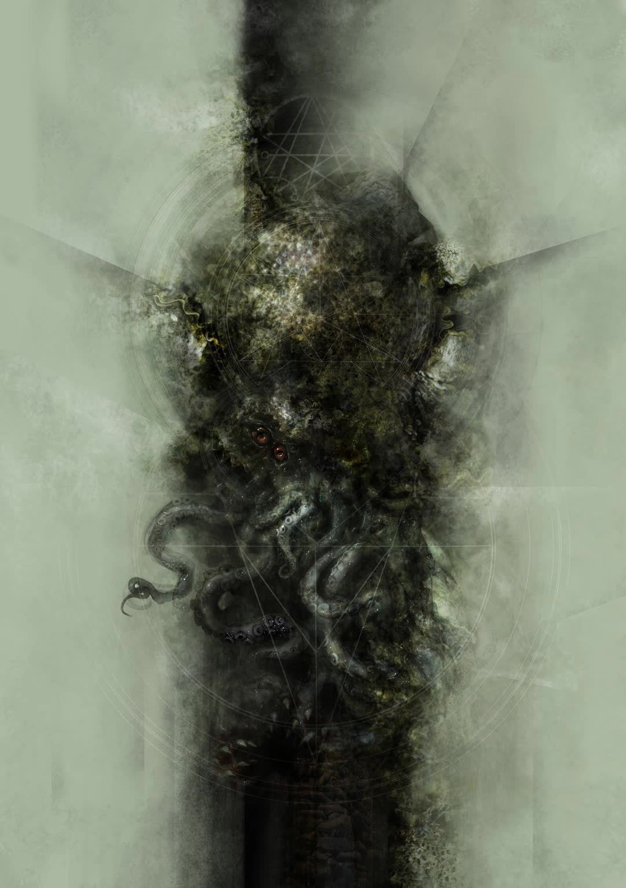

#### Summoning Spirits

Every day millions of Christians congregate in churches across the globe to perform the sacred ritual of the Eucharist. Ordinary bread and wine transform into the flesh and blood of Christ.

The Eucharist is a summoning ritual and therefore shares similarities with the equally ancient technique of Solomonic magic. The Babylonian Talmud, composed around 500 AD from earlier oral sources, describes how King Solomon, ruler of the ancient Kingdom of Israel, summoned the Prince of Demons to help build his Temple.

Over the centuries, Solomon’s magical techniques spread far and wide, occasionally surfacing from subterranean transmission to appear in written form, such as antique magical papyri, medieval grimoires, and in the occult literature of the modern period.

Christianity, from its earliest days, has rejected any identification with the magical practices of earlier and competing religions. Christian rituals are considered holy, not magical. The New Testament mocks the trickery of Simon the Sorcerer. Christ’s miracles, in contrast, are real.

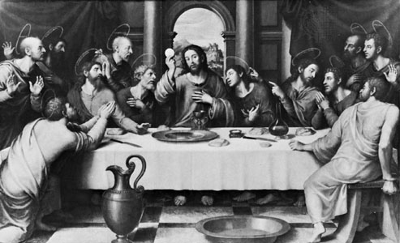

#### The Divine Source of Evocatory Magic

However, the ability of ordained priests to summon Christ, and the ability of occult magicians to summon angels and demons, derive from the same source, which is God.

Christ, in the New Testament, exorcises a demon from a man into a herd of swine. The possessed pigs then go mad and drown in a lake. And Christ, during the Last Supper, anticipating his death on the cross, shared bread and wine and proclaimed, “This is my body … this is my blood.” Christ’s utterance instituted the ritual of the Eucharist for His embryonic Church, the assembled first apostles, in order that His priesthood would not end with His death, but endure for eternity.

The Testament of Solomon, dating from around the 2nd Century AD, describes how the Angel Michael, an emissary of God, gave King Solomon a magical ring stamped with God’s seal in the shape of a pentagram. The magical ring gave Solomon the power to command spirits.

God, being omnipotent, quite naturally has the power to command lesser spirits. And he occasionally grants this power to humans.

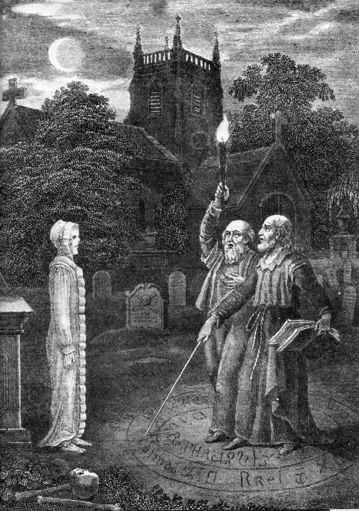

#### The Science of Evocation

The Eucharist and Solomonic magic, as forms of evocatory magic gifted from God, share techniques in common.

Both priests and magicians ritually cleanse, and practice sexual abstinence, prior to the evocation. Both wear special garments that have been blessed and magical talismans, such as a metal cross, or a lamen, hung from the neck, which ward off malignant spirits.

The priest will speak words of consecration over the bread and wine. The magician, within the protection of a magic circle, recites spells, barbarous names, and calls for the aid of thwarting angels. The words are magical due to their divine provenance and transform both priest and magician into conduits of divine power.

Spirit summoning is not to be taken lightly. Spells must be uttered with solemnity and accuracy, and accompanied by precise ritual movements, such as crossing oneself, or gesturing towards the principal directions. The right tools must be deployed. For example, priests of the Christian Orthodox church theatrically wield a hexapterygon, which is a metal staff with a six-winged angel attached to its end, and Solomonic magicians use an iron wand, or a specially forged sword, or a black-handled knife, preferably one previously used to kill a man. These magical instruments help “pin down” the spirit once summoned.

A difficulty of working with spirits, compared to other substances, is that they are typically insubstantial. In consequence, a physical receptacle, or *spiritus loci*, is required for the spirit to manifest into. In the Eucharist the bread and wine plays this role. In Solomonic magic, a Triangle of Art, or brass vessel, incense smoke, or a black mirror, will constrain the spirit to manifest to our ordinary senses.

The moment of manifestation, or epiklesis, can be more or less dramatic. In the Eucharist the summoning is, barring a miracle, always successful. The ordinary bread and wine invariably transform into the flesh and blood of Christ. In contrast, demon summoning is much less reliable, and can fail despite meticulous preparation. Epiklesis, if it does happen, can therefore be more dramatic: the demon a felt, dread presence, or visible in a black mirror, or less frequently fully substantial poised malevolently outside the circle.

The holy sacraments — the transformed bread and wine — are the substantial presence of Christ and therefore deserve the greatest respect and attention of the faithful. The sacraments may be held aloft, or sometimes displayed in a magnificent, ornamental monstrance. Demons are of course dangerous, and not to be trusted. They may fulfil a wish but in a manner that harms the magician. So wishes must be very carefully stated in the form of a binding magical contract. And demons must be given the proper license to depart at the close of the ceremony, otherwise they may linger with dire consequences.

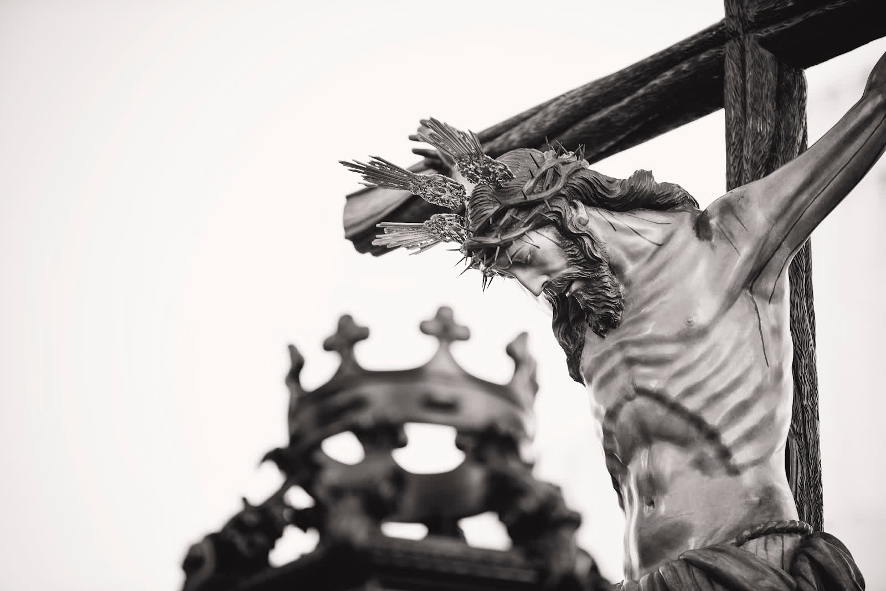

#### God’s Sacrifice

Although the Eucharist and Solomonic magic are both types of spirit summoning the rituals differ in their meaning and significance.

Solomonic magic, from the earliest written examples from around 300 BC, is a method to coerce a hierarchy of spiritual creatures. The Eucharist has no element of coercion. For the Eucharist is a holy communion, a uniting in friendship. So we have nothing to fear — no need for protective circles, or carefully worded magical contracts. Because the Christian God, we are told, bears us no ill will, in fact loves us with a love beyond our imagining.

The Christian altar, in the context of the Eucharist, is a sacrificial altar. Christ, the evoked spirit, does not manifest to do our bidding, but to remind us of His supreme self-sacrifice. God allowed Christ to be put to death by the Roman authorities. The crucifixion was God’s loving self-sacrifice for us. The Eucharist therefore is not merely spirit evocation but also the re-enactment of a sacrificial rite.

The ancient Greeks and Egyptians killed huge numbers of sheep, goats and pigs, in magical rituals designed to elicit divine favour. The pagan gods, although inhuman deities, nonetheless adopted human norms of reciprocal exchange. The greater the sacrificial gift the greater the potential boon. The Old Testament God secured the prosperity and well-being of your household if you sacrificed a lamb and smeared its blood upon your doorposts. A rat just wouldn’t cut it. Even more valuable gifts from the gods, such as their aid in battle, might be obtained by slaughtering thousands of creatures in great hacatombic orgies.

Deicide, the sacrifice of the supreme being, must therefore have incomparably greater value than the sacrifice of a mere lamb, however innocent and undeserving of slaughter. The blood sacrifice of God’s son, the spilling of sinless and innocent blood upon the wood of the cross, was a calamitous loss of God’s presence on earth. What could be a greater sacrifice than putting our creator, abiding amongst us, to the slaughter? In consequence, Christ’s death does not merely secure a single household from the vicissitudes of everyday life but delivers nothing less than the salvation of all households, the entirety of humanity, and ultimately the boon of a final omega point, a blissful union with God.

The bread and wine are cuts of Christ’s corpse, which are then ingested, as per the animal sacrifices of old. This spirit eating refreshes the congregation with the grace of the Holy Spirit. The Eucharist, therefore, is simultaneously a summoning, a sacrifice, and a union with the supreme being, and therefore is highly magical.

But what is magic?

I’ll give a brief answer to this question by stating two fundamental laws of magic. These laws are rarely discussed, and therefore highly occult, because knowledge of them itself has the magical effect of diminishing your magical capacities.

So If you wish to lead a magical life you should stop reading now. Please pause for a few moments, and consider carefully whether you wish to continue. There is no going back.

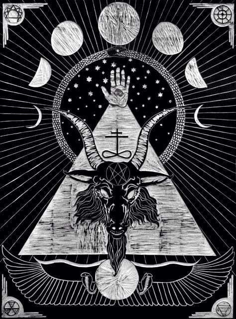

#### The Secret Laws of Magic

The essence of magic is imagination. And so magic always mixes the real with the unreal, including the straightforwardly false.

Real magic, in virtue of this element of falsehood, is therefore related to the ordinary magic performed by a theatre magician. Magical tricks of this kind are designed to create beliefs in the impossible. An object from thin air. We’re surprised and delighted because this event contradicts our beliefs about how the world really works.

But no one, neither the performer or audience member, expects any fundamental revision of their beliefs. We all know the social rules in play. No-one is truly tricked, because the trick is transient and stops when the theatre clears. The audience returns home entertained but unchanged. Because what seemed impossible was actually possible after all.

Real magicians also create beliefs that cannot be true. But here the trick consists in tricking oneself and others in order to create persistent beliefs in the impossible. Real magicians — when drawing down an angel into a crystal, or summoning a goetic spirit in the murky corner of a cold chamber, or when manifesting Christ in ordinary bread and wine — authentically believe in the efficacy of their rituals. The horror or awe can be intense, and the memory enduring, persisting beyond the close of the ritual.

Real magic works by stimulating our imagination to create and amplify liminal gaps in our ordinary theories of how the world works. And then fills those gaps with extraordinary, esoteric content. Real magic, when successful, breaks free from ritual events to suffuse everyday life with new significance and meaning.

Nobody believes ordinary magic is real. But in real magic, everyone is supposed to.

And so the first law of magic states that magic works when the participants believe that it works in precisely the way it does not. If the participants truly understood the mechanisms at work then the magic would dissipate and lose its power. Magic works best when you fully and genuinely believe it to be true.

The second law states that the power and impact of a magical effect increases with the incredibleness of the associated beliefs. Having a minor wish come true after tossing a coin into a well is nice but could be a coincidence, whereas communication with the godhead in visible form might shatter your personality, and alter the entire course of your life.

A necessary consequence of these laws is that real magicians, whether consciously or not, must navigate a fundamental social engineering trade-off: stronger magical effects require belief in more incredible falsehoods, but more incredible falsehoods are more difficult to believe. Real magic has a power-credulity trade-off.

This trade-off explains why magical texts, from antiquity to the present day, demand large investments of time to gain secret knowledge and power. Initiates must master large tracts of magical lore, and regularly meditate to heighten their ability to concentrate credibly on the incredible. Magical tools must be constructed from difficult to obtain materials. Rituals should be performed in precise circumstances at the right time of day under the right alignment of the stars. This hard work and commitment adds up to significant material and psychological sunk costs. The techniques prime the practitioner, and can heighten the expectation of a magical effect to such a crescendo that the ritual, when performed, delivers a commensurate return on the investment of time and effort, a real bang for buck, that is a real effect.

So real magic really works.

Magicians, with sufficient effort and discipline, can permanently flip their minds, alter their entire conceptual framework, and their interpretation of everyday events. Because what we sense radically under-determines what may be the case. There’s a surprising amount of wiggle room for magical worldviews that remain consistent with great swathes of sensory data, including belief in extraordinary entities.

All the temples to the pagan gods, whose remains still decorate our landscape, were built by minds fully committed to their real existence. The great Christian cathedrals, erected at huge cost, were truly built to celebrate God’s incarnation as Christ.

In the case of magical phenomena, actual knowledge, of the kind generated by the scientific method, really does kill rather than enhance its subject matter. So the fundamental laws of magic must always remain occluded, truly occult, for magic to work at all.

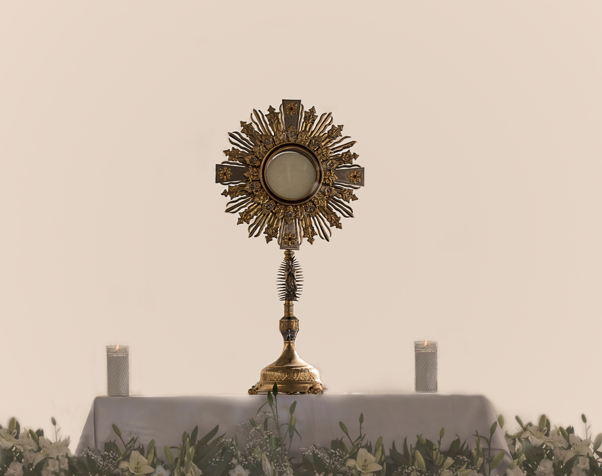

#### The Real Presence of Christ

Magical beliefs, however, cannot float entirely free of the rational norms that spontaneously arise from the necessity to materially reproduce society. Temple builders typically don’t summon demons but apply their knowledge of mechanics. In consequence, maintaining magical credulity requires some accommodation with the general stock of ordinary, non-magical beliefs about what exists and how things work.

The Eucharist — as a summoning, a sacrifice, and a union with the supreme being — is highly magical. It therefore stretches credulity and invites scepticism. The great intellects of Christianity have, over the ages, devoted considerable effort to reconciling its in-group mysteries with the profane knowledge of wider society.

The key challenge is to maintain the power of the Eucharist (deriving from the belief that Christ is actually present during the ritual) without exhausting credulity (deriving from the fact that Christ is actually not). Christian theorists oscillate between two extremes: inflationary interpretations — which claim that God is objectively and therefore miraculously present — and deflationary interpretations — which claim that God is subjectively and therefore mundanely present.

Complete deflation reduces Christ’s presence to a mere summoning to memory. On the upside, this is completely credible. On the downside the magical effect is correspondingly less intense.

Deflationists, in order to retain some magical power, may additionally claim that the bread and the wine are social symbols that refer to Christ, but not mundanely like a road sign, but miraculously in virtue of the power of God. The symbols objectively represent Christ, not merely because we believe it, but in virtue of God’s real presence, both as the Father and the Son. This is more magical, although its credibility is entirely circular.

Inflationary interpretations, on the other hand, propose that Christ is really present in the bread and wine. This is an ambitious claim. But inflationists are quick to emphasise that it would be theologically naive to think that any scientific experiment could in principle verify this presence. God forbid that God be tested by mere human intellects.

Instead, medieval theologians recruited the Aristotelian distinction between an invariant substance (e.g. a collection of H2O molecules) and its accidental properties (e.g. whether water is a liquid, solid or gas; whether hot or cold; whether transparent or opaque etc.) to account for the fact that the bread and wine, during the ritual, remains quite unchanged according to our senses. The divine manifestation, the actual hosting by the host, does not alter the accidental properties of the bread and wine but “transubstantiates” their underlying substance. But we can only sense accidental properties so this change is inaccessible to us. As some theologians courageously point out, Christ’s statement that “this is my body” does communicate a “statement of fact” but not one “of the empirical order”.

Inflationary interpretations clearly have greater magical power. So powerful that the magic can break through into accessible reality.

The Feast of Corpus Christi, which celebrates the Real Presence of Christ, was inaugurated by Pope Urban IV in 1264 in response to the miracle of a consecrated host leaking actual blood onto a cloth. In the 20th century, traces of myocardium tissue were found in consecrated bread that showed signs of stress consistent with death due to traumatic crucifixion. And the magic of the Eucharist very occasionally extends even to the lowly animals. The 13th Century Dialog on Miracles reports that bees created a shrine to Christ after sacramental bread was placed in their beehive.

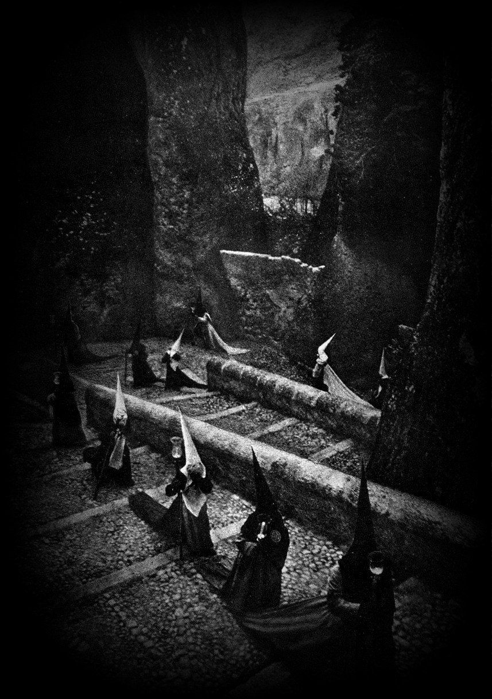

#### A Spiral of Spiritual Production

Regardless of the theological subtleties, the Eucharist yields a fruit, an output, a product, which has a dual, or two-fold character. On the one hand, it is bread and wine; on the other, the flesh and blood of Christ, either substantially or referentially. The extraordinary product of the Eucharist is nothing less than the substance of God, the supreme being, but in a sacrificed state.

The faithful consume the divine substance to bond with the Christian community in familial love and unite intimately with Christ and receive spiritual nourishment and redemption, which is the fruit of his original sacrifice on the cross. Christ stated that:

> “Whoever eats my flesh and drinks my blood has eternal life, and I will raise him on the last day.”

> John 6:54

So the Eucharist also promises a kind of immortality. This divine substance, in virtue of its magical powers, has been in high demand for roughly two millennia.

But the Eucharist isn’t merely a self-reproducing cycle of production, distribution and consumption of a divine substance. The Eucharist is intended to be performed on ever increasing scales. Christ gave his disciples the power to command demons and instructed them to go forth and baptize all nations. Christianity grew rapidly from a small Jewish cult to become the official religion of the Roman Empire and then to dominate the spiritual life of medieval Europe. The mission of Christ’s Church is to spread the gospel, that is the good spell, to all of humanity, and observe the Eucharist on greater and greater scales, thereby summoning greater quantities of the salvific substance into our material world, until, in the limit, on the last day, the whole of creation is filled with divine love, and saved and redeemed, in holy and eternal communion with God.

Mass participation in the Eucharist spirals humanity upwards towards the Good. The Eucharist is a magical solution to the problem of evil that has captured the imaginations of millions and significantly affected the course of human history.

The Eucharist is powerful magic indeed. However, it is a very puny thing compared to the immense magical power of the Dark Eucharist, which we will now turn to.

### Part Two: Dark Enchantment

The moment of epiklesis, when summoning a spirit, may be experienced as a sudden revolution in the meaning of what is already empirically present. The shadow in the corner, which you watched with growing fear, stirs imperceptibly, to reveal a substantial form. The “horrors beyond life’s edge” exist, and exert their baleful influence, long before we notice them.

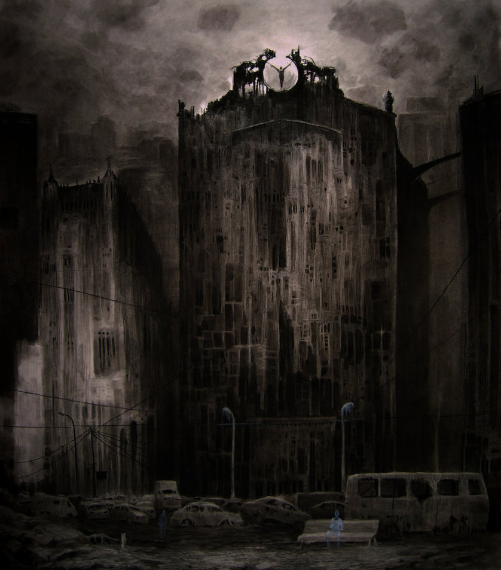

#### Disenchantment

Capitalism, as it broke free from the feudal constraints of monarch and church, developed its own commercial culture where the ultimate judge was worldly success measured by profit. Of course, the bourgeoisie happily maintained any religious ideas consistent with capital accumulation. But in general the Enlightenment of the 18th century had a radically secular core.

The growth of industry meant more people with their heads down on the pragmatics of production. Everyone was busy with a new type of business. Eyes drifted less frequently upwards to ponder superlunary beings. And so magical world views became less relevant, and religion relegated to a few hours on Sunday.

The new field of social science, confident atop its bourgeois base, began to view religion and magic as cultural objects to study and compare, rather than ideas to live and die by. Social science even turned its attention to its own preconditions. The sociologist, Max Weber, viewed the commercialisation of society as a process of disenchantment, a triumph of the secular over the sacred.

Yet, as all magicians know, powerful magic can only be dispelled by more powerful magic. Capitalism’s focus on commercial success, and its pervasive scientific and instrumental rationality, cannot fully explain the death of God.

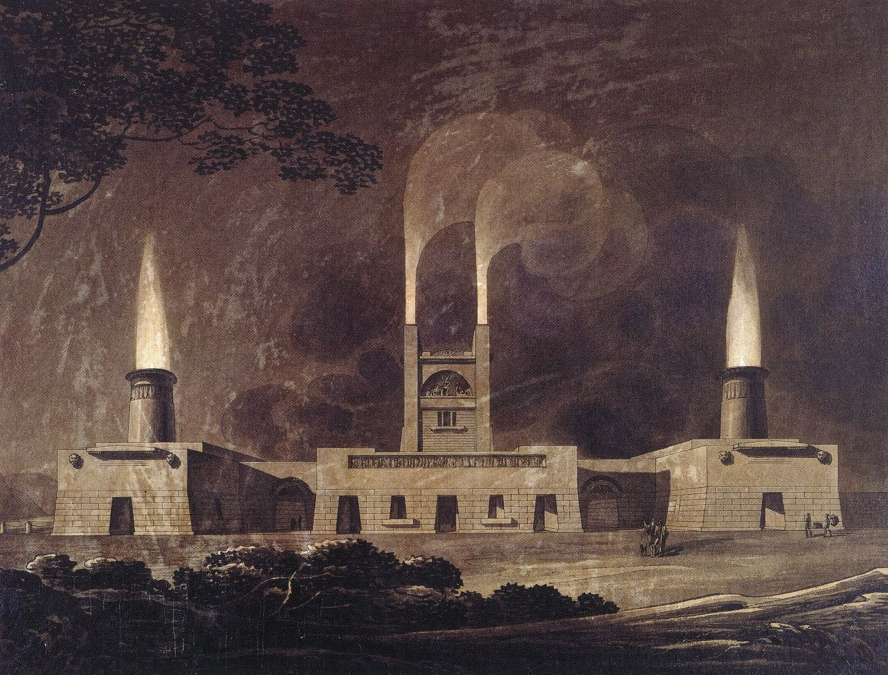

#### A Spiral of Material Production

The science of economics is capitalism’s own account of its fundamental nature. It emerged as a distinct field of inquiry in the 18th and 19th centuries. From the outset, it was conceived primarily as a science of human behaviour subject to material constraints, such as the scarcity of land, labour and capital.

The classical liberal vision of a capitalist economy is that of a great exchange between people mediated by money and markets. At one end of the social organism people produce goods, at the other end people consume them. Market exchange connects and integrates the two poles. The laws of supply and demand ensure production adjusts to what consumers want. Those with capital hire labour at a fair market price when needed, and release labour to be deployed elsewhere when it’s not. Labour is therefore deployed correctly, although with unavoidable but temporary unemployment. The economy, driven by human wants and needs, adapts and grows via profit-rate signals that incentivise innovation and efficiency, which enables production at increasing scales. Of course, resource constraints cannot be abolished. Not everyone can have everything they want. At least not right away. But profit-seeking, hard work, and prudent saving for the future inexorably yields the fruits of increasing material wealth and spirals humanity upwards towards a final omega point of the universal satisfaction of all human desires.

A core belief of capitalist ideology is that we humans drive the system, that we are ultimately in control. The marginal turn in economic science, in the 19th Century, solidified around the vision of *homo economicus*, the rational individual that acts to optimise their self-interest. Neoclassical economics, in the 20th Century, proposed “representative agents”, which are single minds that aggregate the preferences of millions, with the power to steer national economies by maximising utility according to the axioms of rational choice theory. Yes, the state may need to intervene to uphold property rights. It may even need to break up a monopoly here and there. But in general we humans, when we self-organise through money and markets, control our own destiny and achieve optimal outcomes.

Humanity, in the enchanted worlds of classical antiquity and the middle ages, consorted with spiritual beings. Hence the long history of sacrificial exchanges between peoples and their gods. But capitalism has done away with the gods. In our disenchanted world the unmoved mover is our own human desires, not a hidden spirit. Economics envisions capitalism as a great secular exchange between humanity and itself. We face each other in the market, and nothing stands in between. We are sovereign individuals, free of feudal superstition, and free to buy and sell as we wish.

But free within constraints. We are all subject to the fundamental laws of economics that emerge from our collective behaviour. Resource scarcity cannot be abolished. We must therefore accept that almost everything we do is both enabled and constrained by the quantity of money at our disposal. Because the money in our pockets, we are told, is merely a local representation of this global scarcity. If you have very little, and your life is impoverished, that’s lamentable but not really preventable.

The secular vision of economics is consistent with many aspects of our everyday experience. But shadows loom on the edge of this vision that hint at other realities. The science of economics neglects that emergent laws must be enforced by emergent powers. Capitalism disenchanted the medieval world only by weaving its own new enchantment. But it is a dark enchantment that hides the existence of a great power of enforcement that lurks in the shadows. When we face each other in the market it stands between us, not as mediator of our desires, but as controller of them.

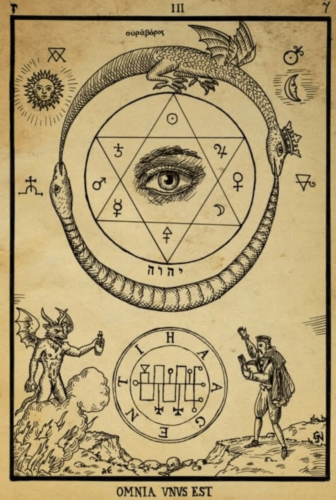

#### Egregores

We can begin to dispel the dark enchantment, and discern the outlines of the great power that lurks in the shadows, once we realise that our economic activities do not instantiate mere economic laws but entire feedback control loops that function as semi-independent entities that control the activities of their own human substrate. Egregores, not merely economic laws, supervene upon our social practices.

An egregore is an entity that exists in virtue of the collective ritual activities of a group yet operates autonomously, according to its own internal logic, to materially influence and control the group’s activities. The group creates the egregore, and the egregore creates the group, in a self-reinforcing feedback loop.

As [Edmund Griffiths](https://link.springer.com/book/10.1057/9781137346377) points out, we take the existence of mundane beings — such as people, animals, plants, and so on — for granted. But religions typically propose the existence of extraordinary beings. Such propositions form part of the core beliefs of the religious system and are charged with emotional affect. For instance, all gods are personified egregores that their followers believe exist independently of them.

Christ, for example, is one of the egregores of the Christian faith, believed to be God literally personified as a human. This claim may be true or false. But the social reality of egregores, and their real effects, is quite independent of this judgement. In fact some egregores exist, without being known at all.

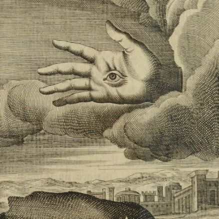

#### The Real Presence of the Real God

All modes of production need methods to organise labour and allocate resources. But Marx, in his 1844 comments on James Mill, points out that, in capitalism, this necessity takes an unnecessarily alienated form. And by alienated he means taken out of our hands and given over to something not under our conscious control.

Marx states that, in capitalist society, our economic activities are controlled by an actual entity, a “real God“, with real causal powers. And Marx laments that we have become slaves to this god and its cult has become an end in itself. In other words, the social relations of capitalism summon forth an egregore.

How? Capitalism is a social system dominated by competing private capitals. A private capital is not merely a large sum of money but a feedback control system entirely oriented towards profit maximisation. Capitalists, as temporary owners of capital, must seek out profit or see their capital diminish and risk being thrown down into the ranks of waged workers. And waged workers must seek out capitals willing to hire their labour. The laws of capitalist competition, which are an unintended consequence of our particular methods of organisation, compel us all to behave in certain ways — and therefore partially create the kind of beings that we are. The humans in the loop, both the workers making and the capitalists taking, dutifully perform their allotted social roles, like enchanted rag dolls.

Capitals are born, combined, split, and die. Many are small, extracting profit from a handful of waged labourers; a few are astronomically large, extracting profit from hundreds of millions. Capitals can persist over multiple generations, outliving their temporary human vehicles.

Each private capital manically scrambles for profit by reacting to profit-rate signals from every productive activity that can be owned, dispensing monetary rewards and punishments, injecting funds into profitable activities and withdrawing funds from those that are not. In consequence, the entirety of the world’s material resources, including the working time of billions of people, are repeatedly marshalled and re-marshalled away from low and towards high-profit activities.

Marx’s Real God, which he names “capital”, is an egregore summoned into being by every circuit of capital accumulation. The egregore is a semi-autonomous entity with its own primitive form of cognition: it wants profit, it senses the presence and absence of profit, and then it acts in its world to get more profit.

Our earliest theories of how the world works were animistic. The God of the Old Testament became angry and punished Israel with pestilence. Modern science rejects this anthropomorphism and instead explains empirical regularities, whether natural or social, in terms of laws. But laws, properly understood, are descriptions of the causal powers of things. The important truth of archaic animism is that our world is indeed populated with things with their own powers that exist independently of us.

Marx’s Real God is just such an entity. It is a real presence amongst us. Its imperatives possess our minds and dictate our actions. It is not made of flesh and bones. It has a purely social reality. Nonetheless, this bloodless animism has bloody consequences.

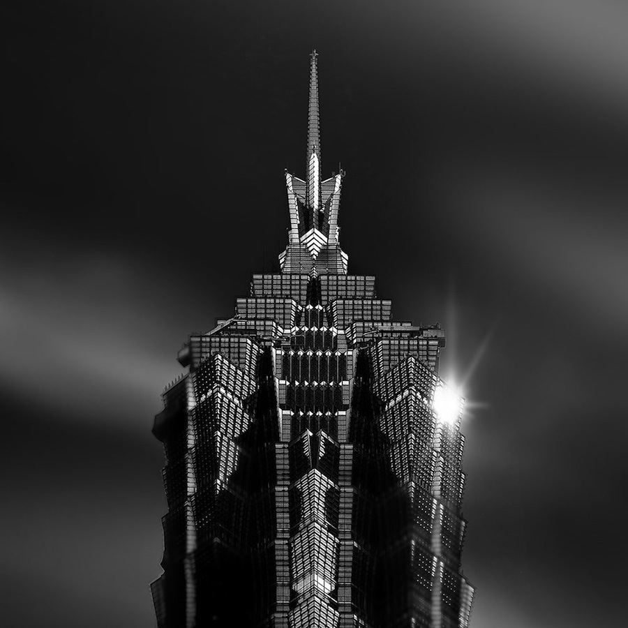

#### An Occult Mode of Production

Christ’s church celebrates his real presence during the Eucharist. But capitalism neither celebrates or personifies its Real God. In fact, its egregore is so thoroughly occulted it still lacks a complete theoretical expression and therefore a proper name.

The Real God is hidden for two main reasons. First, what exists is not immediately disclosed by direct experience. We must perform scientific work to uncover the hidden social mechanisms that govern our lives. Capitalism’s egregore is a consequence of our social relations and therefore is objectively hidden. Its singular and enduring existence must be inferred from the plurality of its empirical effects. And it wasn’t until the Marxist heresy of the 19th Century that this inference first reached maturity.

The second reason is more magical, and therefore more a matter of imagination. The etymological root of the word religion is to bind, to create an obligation between humans and a god. All religions bind their communities. So we should expect structural similarities between religious and economic practices because they both organise and integrate communities.

Any social institution needs a good news story to give meaning to its rituals. Christ is worshipped for his message of salvation. However, capitalist ideology, to preserve its magical power, must deny its own god, otherwise it risks unbinding its community. *The knowledge that the world is controlled by an alien entity — which converts every labour-saving innovation into the iron necessity to work even more, which outrageously rewards those few it possesses with power and riches while leaving the majority dispossessed, which corrupts democracy and prevents it in our workplaces, which captures the great power of the state to enlarge its domain, discipline the poor and suppress opposition, which drives nations dominated by large capitals to compete to exploit those dominated by smaller capitals, including waging bloody imperial wars of conquest and ruin, which rewards the plundering of the natural world without replacement, and which constrains our collective political imagination to perpetually subsist within the narrow bounds of lamenting but not preventing the human misery it blindly creates — such knowledge must be utterly and thoroughly repressed.* For if more of us knew that it just doesn’t have to be this way, that every one of these social ills, and more, is not a necessary consequence of human intercourse but an unnecessary consequence of the dictatorship of Capital, then the dark enchantment would dispel and the true horror would step forth from the shadows.

Capitalist ideology celebrates a radical and progressive break from feudal paternalism and superstition. Before we believed in gods and magic. But now we are modern and rational. Universal commodification and the private pursuit of profit delivers the goods. This is powerful magic but the panglossian assertions lose credibility when confronted by our lack of control, our repeated inability to change anything for the better. The power-credulity trade-off must therefore be managed.

Bourgeois economics suppresses the Marxist heresy. But widespread failures to deliver the goods still need to be accounted for. Economic science has developed an elaborate theodicy, with a range of theoretical options to suit different levels of tolerance for the incredible, which redirects the blame for social ills onto anything but the existence of the rule of capital. Austrians blame the fall from grace on the lack of hard money. The evil state corrupts by issuing currency by fiat. Neoclassicals trumpet welfare theorems that prove that capitalist competition is a perfect mechanism that delivers optimum outcomes, if only capital was given full reign to commodify everything under the sun. Keynesians, more credibly, admit that unfettered capitalism has problems of coordination and distribution, but less credibly propose that bourgeois politicians, possessed representatives of the Real God, will fix them.

The glamour is strong but wavers in the corner of our eye. We catch glimpses from beyond the veil: capitalists earning more in one night’s sleep than workers do from a lifetime of wages; rich countries with persistent homelessness and yet unused bricks, land, and unemployed construction workers; families hungry in the context of abundant food. Economists are unconscious magicians, for they authentically believe what they preach, and their words of power continually re-weave the dark enchantment by maintaining incredible beliefs in the intrinsic goodness of the rule of capital.

Capitalism does not transcend religion. It is merely its inverted opposite. We have not yet rid ourselves of spirits, gods and demons. Our world remains enchanted, but darkly. Capitalism is an occult mode of production with a hidden god and a Dark Eucharist. For any sufficiently advanced religion is indistinguishable from economics.

### Part Three: The Magic of the Dark Eucharist

#### Marx on Money and Christ

Marx, in his [comments on Mill](https://www.marxists.org/archive/marx/works/1844/james-mill/), after stating that capitalism is a new kind of cult that worships a Real God, immediately reflects on the strange affinities between Christ and money. Marx writes:

> “Christ represents originally: 1) men before God; 2) God for men; 3) men to man.”

This is an elliptical statement. But Marx suggests that Christ is a multivocal symbol that mediates how humanity relates to itself and to God. The thesis is Christ as an ordinary man, like all of us, humble before God. The antithesis is Christ as God incarnate who loves His creation. The synthesis, which transcends the contradiction, is the Church, our human community and Christ’s mystical body, which binds us together in a holy communion mediated by God.

Next Marx applies this same template to money:

> “Similarly, money represents originally, in accordance with the idea of money: 1) private property for private property; 2) society for private property; 3) private property for society.”

Marx suggests that money is Christ-like for it too is a multivocal symbol that mediates how humanity relates to itself and to its property. The thesis is money as a symbol of the value of our individual property. The antithesis is money as the social incarnation of property in general. The synthesis is the ritual of market exchange that binds humanity together in a material communion mediated by money.

But Marx is not yet finished. Although Christ and money are mediating symbols that bind a community they are also social symbols that are quasi-independent of us, and above us. The integration they achieve is incomplete, part real, but part illusory and therefore magical. Marx writes:

> “But Christ is alienated God and alienated man. God has value only insofar as he represents Christ, and man has value only insofar as he represents Christ. It is the same with money.”

“It is the same with money” because money is an alienated symbol of our own powers. And in a society ruled by its alien mediator, the Real God, both the social and the personal only have value, only represent the Good, insofar as they represent money. We use social symbols to mediate our relations. But we become mere symbols for the mediator. And in these abstractions we lose something of ourselves, and become enchanted.

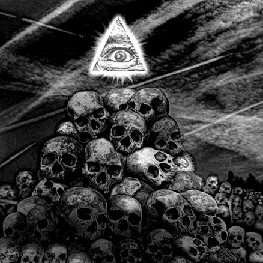

#### The Sacrificial Orgy

*The Dark Eucharist is the origin of profit in the sacrifice of our labour as tribute to the Real God.* And like the Christian Eucharist it is simultaneously a summoning, a sacrifice and a union.

Money has many different material forms, such as precious metal, or coins or notes, or numeric entries in a database. But these material forms are mere vehicles for the unit of account, economic value itself, which is a social symbol. Bourgeois economics long gave up the attempt to fully decipher this social hieroglyphic and has converged to almost complete silence on the question. We’re told that the unit of account is a quantity without quality, a token of nothing, a symbol that does not symbolise. But money has an esoteric content because, in the Dark Eucharist, it functions as the host.

Every capitalist firm is a house of god, a site of tribute to capital. Workers, in their daily ritual, sacrifice their labour to produce useful things for others. But the real aim is a hoped-for fruit, a divine yield, a profit. So not any sacrifice will do. The sacrifice must be sufficiently efficient and useful that the product, when sold, yields an excess, a shining sum of money profit. Profit is the moment of epiklesis when more of the salvific substance is summoned into the world.

All the individual rituals form part of one great ritual. And all the individual capitals are merely a thousand faces of the same god. A necessary condition for the success of the great ritual is that workers truly sacrifice themselves. This cannot be a mere exchange with god; it must be a tribute, a genuine giving up. For profit in the aggregate is only possible if workers collectively sacrifice more of their time to capital than they receive in the form of the goods and services they consume.

The Real God is an entity that manipulates a particular feature of the world via money flows in order to achieve control success, which is more profit. That feature is our collective labour willing and able to sacrifice itself. Money is therefore both an aspect of the Real God’s presence and a representation of our own labour powers. In the Eucharist ordinary bread and wine represent Christ in virtue of the actions of the Holy Spirit. In the Dark Eucharist money represents sacrificed labour in virtue of the actions of the Real God. *Money is the symbolic union of humanity with its god.*

The money profit, as the substantial presence of the Real God, inherits divine power. Money is the universal use-value, the universal Good, able to make our wishes come true. We all desire to possess it, to hold it, to commune with it, for we are lost souls without it.

The capitalists, as orchestrators of the sacrificial rite, divide and share out its fruit. This substance is so precious that not a drop can be spilled or lost. Even the smallest fraction must be accounted for. Its subsequent distribution to the assembled faithful is a carefully controlled affair, subject to strict rules. The poorer cuts are distributed to the workers who receive the boon of a wage. But the best cut is reserved for capital. Each Dark Eucharist augments the power of the Real God, enabling it to command a greater share of our products, to extend its private domain through the ownership of more productive assets, to enclose more and more of the world as its private property, and attract greater numbers to join the sacrifice. Our tribute increases the power of capital and deepens our servitude to it. For beneath the apparent chaos of market prices, and the fluctuations of supply and demand, is a simple order. All the prices of all the things in the world, and all the wages, are always such to prevent workers saving sufficient quantities of the divine substance to enjoy more free time. *The Real God prevents its subjects from controlling how long they work by collectively deciding on the rate of economic growth and the length of the working day.* The salvific fruit cannot be saved, and therefore cannot truly save us, for it flows back to capital itself, to increase its power of command. The simple and universal underlying order is: sacrifice yourself, forever.

In consequence, the money in our pockets does not only represent necessary scarcity. The distribution of monetary wealth, and the structure of prices, also represents our unnecessary servitude, our collective kneeling down in worship of a fetish. The money wage is a reward for sacrifice that compels further sacrifice. Disenchantment is a myth, itself part of the dark enchantment. For a god abides with us still. And if we wish to see its face we need merely reach into our own pockets.

We yield up and offer nothing less than our living activity. There is no greater gift we could give. We sacrifice fractions of our living essence, our unique and finite being, every single working day, until eventually we have nothing left and our health fails. And then we are fully spent, entirely transubstantiated into the private property of our Dark Lord and Master.

")

#### Triumph of the Demiurge

The Christian Eucharist aims to unite humanity in familial love, to care for the sick, the needy and the poor, and lead us to salvation from the ills of this world. The utopian aspirations of Christianity, there from the beginning, and still with us now, express some of humanity’s deepest and most noble aspirations.

Christ chose bread and wine to share because these are goods we want: one subsistence, another luxury — a perfect representation of our material aspirations. Christ did not choose money. He remarked that:

> “No one can serve two masters. Either you will hate the one and love the other, or you will be devoted to the one and despise the other. You cannot serve both God and money.”

> Christ, Matthew 6:24

Christ understood that money was already spoken for, that it already hosted a host.

The Christian God turned out to be powerless before the historic rise of the Real God. Today, a large capital looms above the performance of every Christian ritual. All denominations prudently manage their portfolio of investments searching for a wholly different kind of divine yield, quite content to share in the sacrificial spoils of the Dark Eucharist. Christ’s ejection of the money lenders from the temple, the medieval proscriptions against usury, the attempts to define and impose just prices, the angry denials that money can be fruitful, are largely forgotten, faint echoes from a time before the triumph of the demiurge. Christianity has made its uncomfortable peace with capital, and bowed to its rule, often standing shoulder-to-shoulder with those driven mad by the Real God’s insatiable appetite, giving its blessings to colonial conquest, slavery and imperial war, liberating souls for one god while liberating gold for another.

The Dark Eucharist, performed daily by billions of workers across the globe, transubstantiates our sacrifices into the corporeal body of a hidden God. The Dark Eucharist, unlike the Christian ritual, does not unite humanity in love but divides us into an anointed elite, the exploiting class, and a sacrificial flock, the exploited class. During the ritual the Real God does not sacrifice itself in love for us and neither grants wishes at our command. This is a new kind of magic, neither Christian or Solomonic. Instead, the Real God consumes our flesh and blood, uses-up our living activity, and thereby acquires our powers for itself. A universal dark enchantment conceals the fundamentally idolatrous and sacrificial nature of the capitalist mode of production. We blindly worship a blind God. And the true meaning of money — as the Real Presence of the Real God in our lives — remains occulted.

Capitalist society is, as Marx wrote, “like the sorcerer who is no longer able to control the powers of the nether world whom he has called up by his spells.” Perhaps the greatest bourgeois myth, the height of its hubris and the essence of its magical power, is the belief that capitalism is a secular and rational mode of production. But a deep unacknowledged continuity exists between capitalism and its enchanted precursors. Capitalism is an occult mode of production controlled by a hidden God that manipulates its subjects to engage in great orgies of unnecessary sacrifice and ecstasies of blind accumulation. We may live in an Age of Reason but the Reasons are not our own. The great sacrificial exchanges between a people and its god are not overcome by capitalism but reproduced in a new and more universal form. We will therefore remain not yet modern, wandering lost in the dark ages of humanity, until we throw off our dark enchantment, dare to look into the depths of the black mirror and confront the horror we have summoned forth.

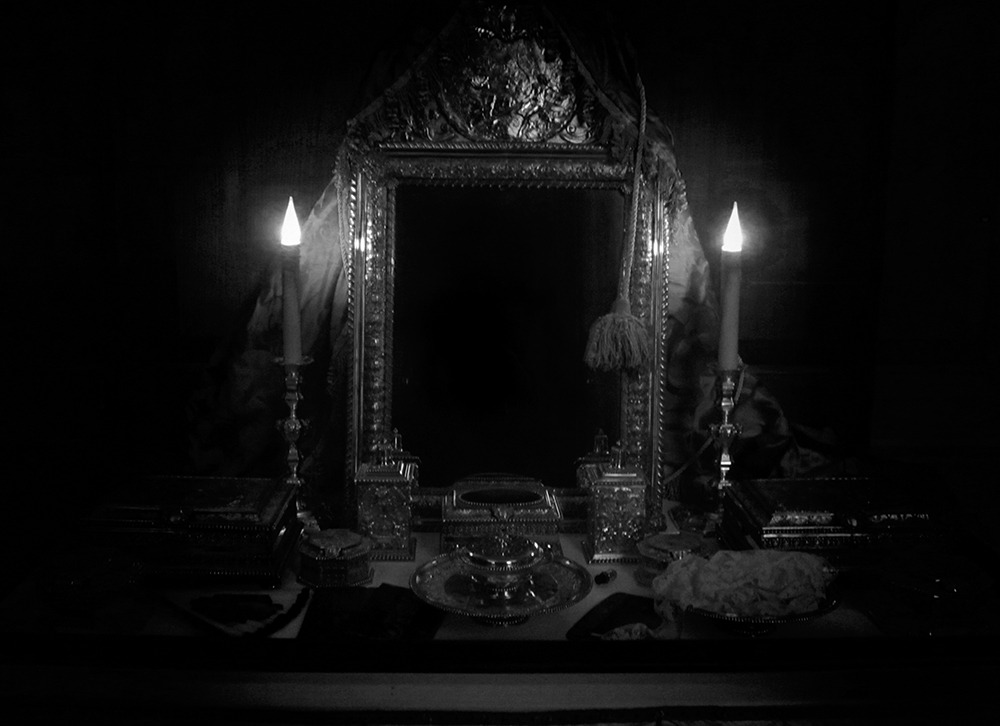

#### Further Reading

 - [Comments on James Mill](https://www.marxists.org/archive/marx/works/1844/james-mill/), Karl Marx
 - [The Fetishism of Commodities and the Secret thereof](https://www.marxists.org/archive/marx/works/1867-c1/ch01.htm#S4), Karl Marx
 - [Fossil Angels](https://glycon.livejournal.com/13888.html), Alan Moore
 - [Towards a Science of Belief Systems](https://link.springer.com/book/10.1057/9781137346377), Edmund Griffiths
 - [Techniques of Solomonic Magic](https://www.amazon.co.uk/Techniques-Solomonic-Magic-Stephen-Skinner/dp/0738748064), Stephen Skinner.
 - [Capitalism as Religion](https://cominsitu.wordpress.com/2018/06/08/capitalism-as-religion-benjamin-1921/), Walter Benjamin.
 - [Enchantments of Mammon](https://www.hup.harvard.edu/catalog.php?isbn=9780674984615), Chapters 1 and 2, Eugene McCarraher.
 - [On Capital and Labour](https://www.vatican.va/content/leo-xiii/en/encyclicals/documents/hf_l-xiii_enc_15051891_rerum-novarum.pdf), Encyclical of Pope Leo XIII.